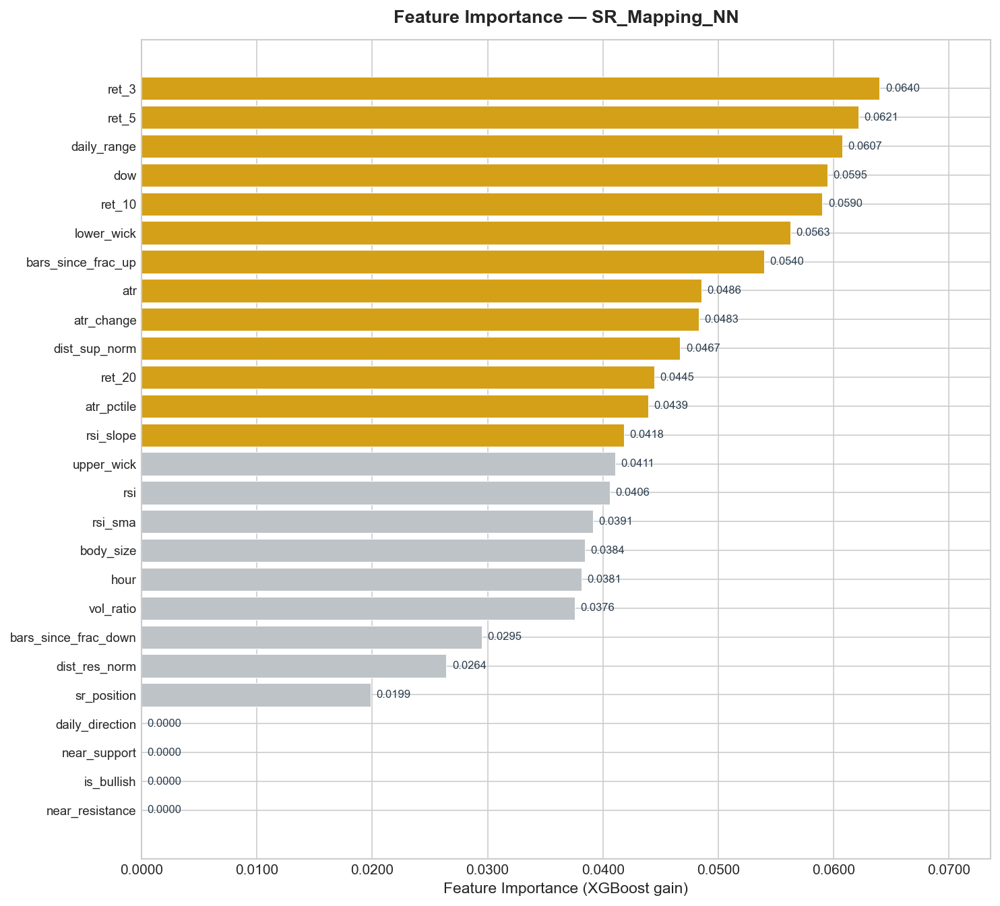
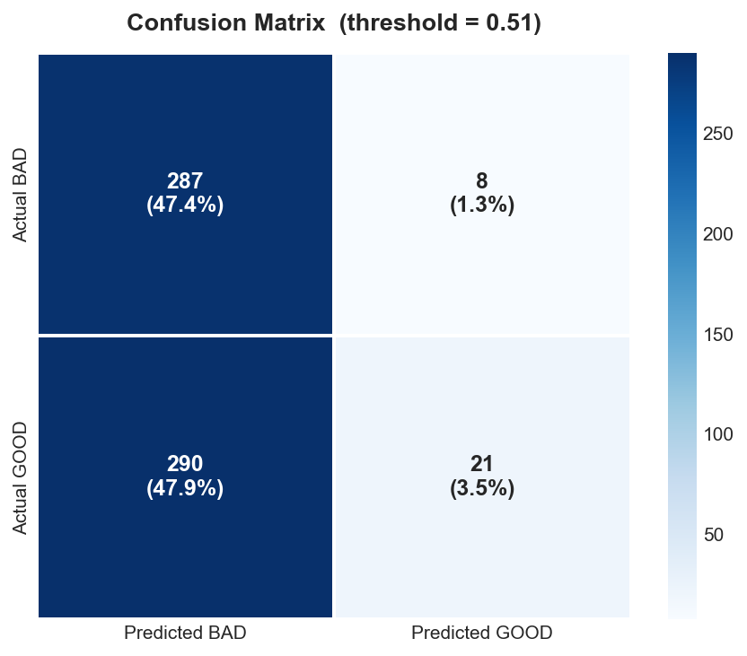
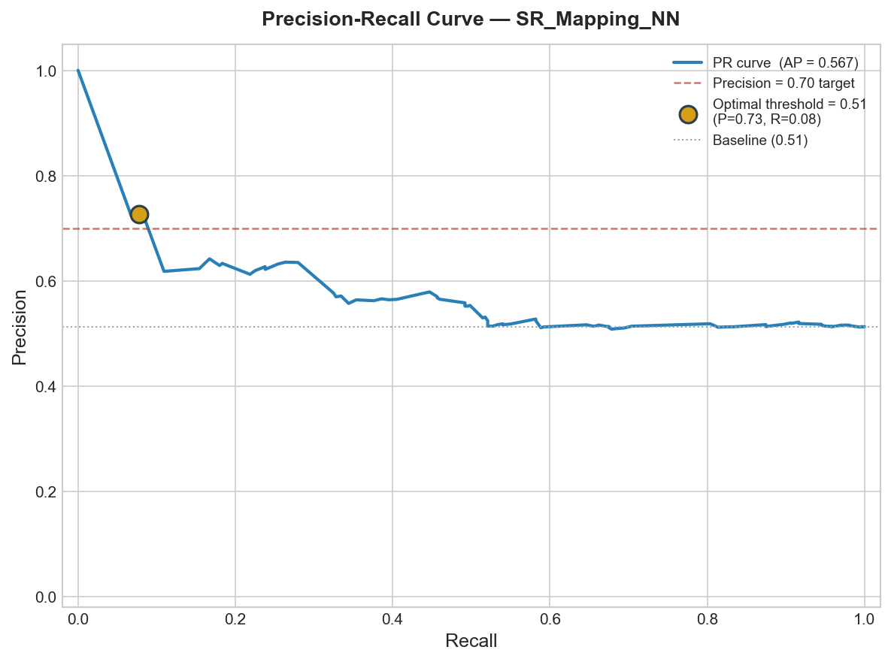
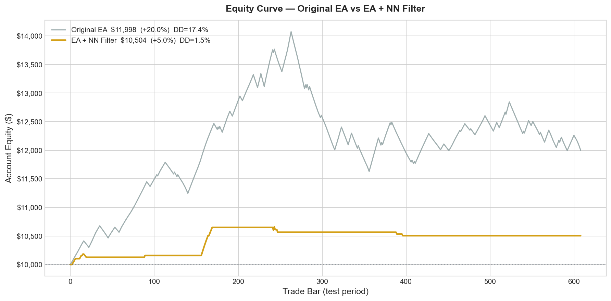

# SR_Mapping_NN — Neural Network Entry Filter untuk XAUUSD

> **XGBoost classifier yang menyaring sinyal entry EA MetaTrader 5.**  
> Menggantikan grid/martingale dengan AI-based risk management.


---

## Daftar Isi

- [Tentang Proyek](#tentang-proyek)
- [Arsitektur Sistem](#arsitektur-sistem)
- [Hasil Model](#hasil-model)
- [Struktur Repository](#struktur-repository)
- [Roadmap & Workflow](#roadmap--workflow)
- [Instalasi & Penggunaan](#instalasi--penggunaan)
- [Panduan Deployment ke MT5](#panduan-deployment-ke-mt5)
- [Detail Teknis](#detail-teknis)
- [Limitasi & Catatan Penting](#limitasi--catatan-penting)
- [Lisensi](#lisensi)

---

## Tentang Proyek

### Latar Belakang

EA **SR_Mapping_Foundation v7.1** memiliki sinyal entry yang kuat (91.10% win rate, profit factor 2.37) tetapi menggunakan **grid martingale 10x** untuk risk management, yang menyebabkan:
- Max Equity Drawdown: **40.69%** (berbahaya)
- Risiko margin call tinggi pada kondisi trending

### Solusi

Membangun **XGBoost classifier** yang belajar dari pola pasar untuk menyaring entry:
- **GOOD entry** = langsung menuju Take Profit
- **BAD entry** = akan hit Stop Loss

Grid/martingale **dihapus total**. Setiap trade dilindungi SL/TP individual.

### Backtest EA Original (11 bulan, Dec 2024 — Nov 2025)

| Metrik | Nilai |
|--------|-------|
| Total Trades | 820 |
| Win Rate | 91.10% |
| Profit Factor | 2.37 |
| Net Profit | $57,893 (dari $1,000) |
| Max DD | 40.69% (**MASALAH**) |

---

## Arsitektur Sistem

```
┌─────────────────────────────────────────────────────┐
│                  MARKET DATA (Live)                  │
│          XAUUSD M1/M30/D1 dari MetaTrader 5         │
└────────────────────┬────────────────────────────────┘
                     │
                     ▼
┌─────────────────────────────────────────────────────┐
│          SR_Mapping_NN_v1.mq5 (EA di MT5)           │
│                                                      │
│  1. BuildSNR()          → Fractal S/R levels         │
│  2. GetRSI_M1()         → RSI(14) pada M1            │
│  3. GetATR_M1_Points()  → ATR(14) pada M1            │
│  4. DetectDailyRange()  → Arah harian (+1/0/-1)      │
│  5. Signal Check        → BUY/SELL conditions         │
│                                                      │
│  ┌──────────────────────────────────────────────┐    │
│  │        NN FILTER (BAGIAN BARU)               │    │
│  │                                               │    │
│  │  PrepareFeatures() → 26 fitur real-time       │    │
│  │         ↓                                     │    │
│  │  sr_mapping_nn.onnx → XGBoost inference       │    │
│  │         ↓                                     │    │
│  │  confidence >= 0.51 ?                         │    │
│  │    YES → ExecuteBuy/Sell (dengan SL/TP)       │    │
│  │    NO  → SKIP (log reason)                    │    │
│  └──────────────────────────────────────────────┘    │
│                                                      │
│  6. ManageSmartTrailing() → Trailing stop aktif       │
└─────────────────────────────────────────────────────┘
```

---

## Hasil Model

### Performa pada Test Set (Sep — Nov 2025)

| Metrik | EA Original | EA + NN Filter |
|--------|-------------|----------------|
| Total Trades | 606 | **29** |
| Win Rate | 51.3% | **72.4%** |
| Precision | — | **72.4%** |
| Sinyal/hari | ~14 | **~0.5** |

### Charts

#### Feature Importance


#### Confusion Matrix


#### Precision-Recall Curve


#### Equity Curve Comparison


---

## Struktur Repository

```
SR_Mapping_NN/
├── README.md                          # Dokumentasi utama (file ini)
├── requirements.txt                   # Python dependencies
├── .gitignore                         # Git ignore rules
│
├── scripts/                           # Python scripts
│   ├── 01_download_data.py            # Step 1: Download data XAUUSD
│   ├── 02_feature_engineering.py      # Step 2: Hitung semua fitur
│   ├── 03_labeling.py                 # Step 3: Label forward-looking
│   ├── 04_train_model.py             # Step 4: Training XGBoost
│   ├── 05_export_onnx.py            # Step 5: Export ke ONNX
│   ├── 06_generate_charts.py        # Step 6: Buat visualisasi
│   ├── 07_equity_simulation.py       # Step 7: Simulasi equity curve
│   └── run_full_pipeline.py          # Jalankan semua step sekaligus
│
├── mql5/                              # MetaTrader 5 files
│   ├── SR_Mapping_NN_v1.mq5          # EA utama (ONNX-enabled)
│   └── DEPLOYMENT_GUIDE.md           # Panduan deploy ke MT5
│
├── models/                            # Trained models
│   ├── sr_mapping_nn.onnx            # ONNX model untuk MT5
│   ├── model_xgboost.pkl             # XGBoost pickle
│   └── model_xgboost.json            # XGBoost JSON (backup)
│
├── configs/                           # Configuration files
│   ├── feature_config.json           # Fitur + threshold + normalisasi
│   ├── pipeline_results.json         # Hasil training
│   └── threshold_analysis.csv        # Analisis threshold lengkap
│
├── data/                              # Datasets
│   ├── xauusd_h1.csv                 # OHLCV H1 (Oct 2024 — Nov 2025)
│   ├── xauusd_d1.csv                 # OHLCV D1 (Jan 2023 — Nov 2025)
│   ├── training_data.csv             # Dataset training (4,040 samples)
│   ├── test_predictions.csv          # Prediksi pada test set
│   └── equity_curves.csv             # Equity curve simulation
│
├── charts/                            # Visualisasi
│   ├── feature_importance.png         # Feature importance ranking
│   ├── confusion_matrix.png           # Confusion matrix
│   ├── precision_recall_curve.png     # Precision-recall curve
│   └── equity_curve.png              # Equity curve comparison
│
└── docs/                              # Dokumentasi tambahan
    ├── VALIDATION_REPORT.md           # Laporan validasi lengkap
    ├── EA_LOGIC.md                    # Dokumentasi logika EA
    ├── FEATURE_DICTIONARY.md          # Penjelasan setiap fitur
    └── WORKFLOW.md                    # Workflow diagram lengkap
```

---

## Roadmap & Workflow

### Overview: 7 Step Pipeline

```
STEP 1          STEP 2              STEP 3           STEP 4
Download    →   Feature          →  Labeling      →  Training
XAUUSD Data     Engineering         (TP/SL sim)      XGBoost
                                    
STEP 5          STEP 6              STEP 7
ONNX         →  Generate EA      →  Validasi &
Export          MQL5 Code           Reporting
```

### Step-by-Step Detail

#### STEP 1: Download Data (`scripts/01_download_data.py`)
```
Input:  Ticker GC=F dari yfinance
Output: data/xauusd_h1.csv, data/xauusd_d1.csv

- Download H1 OHLCV (Oct 2024 — Nov 2025): 6,711 bars
- Download D1 OHLCV (Jan 2023 — Nov 2025): 732 bars
- Validasi: cek missing data, weekend gaps, holidays
```

#### STEP 2: Feature Engineering (`scripts/02_feature_engineering.py`)
```
Input:  data/xauusd_h1.csv, data/xauusd_d1.csv
Output: DataFrame dengan 26 fitur per bar

Fitur yang dihitung:
1.  Williams Fractals (lookback=2) → S/R levels
2.  RSI(14) pada H1
3.  ATR(14) pada H1  
4.  Daily Open + Daily Range Direction
5.  Jarak ke S/R (normalized by ATR)
6.  Momentum (return 3/5/10/20 bar)
7.  Volatility regime (ATR percentile)
8.  Candle patterns (body, wicks, bullish/bearish)
9.  Time features (hour, day_of_week)
10. Bars since last fractal
```

#### STEP 3: Labeling (`scripts/03_labeling.py`)
```
Input:  DataFrame fitur dari Step 2
Output: data/training_data.csv (4,040 samples)

Untuk setiap bar dengan daily direction != 0:
- TP = entry ± ATR × 2.0
- SL = entry ∓ ATR × 1.6
- Scan forward 48 bar (48 jam)
- Label = 1 jika TP hit duluan (GOOD)
- Label = 0 jika SL hit duluan (BAD)
- Timeout: gunakan floating P/L

Distribusi: 45.2% GOOD, 54.8% BAD
```

#### STEP 4: Training (`scripts/04_train_model.py`)
```
Input:  data/training_data.csv
Output: models/model_xgboost.pkl, configs/feature_config.json

- Split time-based: Train 70% / Val 15% / Test 15%
- Coba 3 config: balanced, conservative, aggressive
- Pilih config terbaik berdasarkan Val AUC
- Threshold optimization: precision >= 70% target
- Hasil: AUC=0.538, Precision=72.4% pada threshold=0.51
```

#### STEP 5: ONNX Export (`scripts/05_export_onnx.py`)
```
Input:  models/model_xgboost.pkl
Output: models/sr_mapping_nn.onnx

- Convert XGBoost → ONNX via onnxmltools
- Verifikasi: prediksi ONNX vs original (max diff: 0.000000)
- File size: 1.6 KB (sangat kecil, load cepat di MT5)
```

#### STEP 6: Generate Charts (`scripts/06_generate_charts.py`)
```
Input:  configs/pipeline_results.json, data/test_predictions.csv, dll
Output: charts/*.png (4 file)

1. feature_importance.png   — Bar chart ranking fitur
2. confusion_matrix.png     — Heatmap confusion matrix
3. precision_recall_curve.png — P-R curve + threshold optimal
4. equity_curve.png         — Perbandingan equity Original vs NN
```

#### STEP 7: Validasi (`scripts/07_equity_simulation.py`)
```
Input:  data/test_predictions.csv, models/model_xgboost.pkl
Output: data/equity_curves.csv, docs/VALIDATION_REPORT.md

Simulasi equity:
- EA Original: $10,000 → $11,946 (19.5%, 606 trades, WR 51.3%)
- EA + NN:     $10,000 → $10,504 (5.0%, 29 trades, WR 72.4%)
```

---

## Instalasi & Penggunaan

### Prerequisites

- Python 3.10+
- MetaTrader 5 (untuk deployment EA)
- Git

### Quick Start

```bash
# 1. Clone repository
git clone https://github.com/Mrizalfahlepi/SR_Mapping_NN.git
cd SR_Mapping_NN

# 2. Install dependencies
pip install -r requirements.txt

# 3. Jalankan full pipeline
python scripts/run_full_pipeline.py

# Atau jalankan per step:
python scripts/01_download_data.py
python scripts/02_feature_engineering.py
python scripts/03_labeling.py
python scripts/04_train_model.py
python scripts/05_export_onnx.py
python scripts/06_generate_charts.py
python scripts/07_equity_simulation.py
```

### Retrain dengan Data Sendiri

Jika kamu punya data XAUUSD dari broker (Exness, dll):

```bash
# 1. Simpan data M30/H1 ke data/xauusd_custom.csv
#    Format: datetime,open,high,low,close,volume

# 2. Edit scripts/01_download_data.py:
#    Ubah DATA_SOURCE = "custom"
#    Set CUSTOM_FILE = "data/xauusd_custom.csv"

# 3. Jalankan pipeline
python scripts/run_full_pipeline.py
```

---

## Panduan Deployment ke MT5

### Langkah Cepat

1. **Copy EA:** `mql5/SR_Mapping_NN_v1.mq5` → `MQL5/Experts/`
2. **Copy Model:** `models/sr_mapping_nn.onnx` → `MQL5/Files/`
3. **Compile** di MetaEditor (F7)
4. **Attach** ke chart XAUUSD (M30 atau H1)
5. **Set parameter** (lihat tabel di bawah)

### Parameter Wajib

| Parameter | Nilai | Keterangan |
|-----------|-------|------------|
| `InpUseNNFilter` | `true` | Aktifkan NN filter |
| `InpConfidenceThresh` | `0.51` | Threshold confidence |
| `InpUseStopLoss` | `true` | **WAJIB** (grid dihapus) |
| `InpUseATR_SLTP` | `true` | SL/TP berbasis ATR |
| `InpSL_ATR_Mult` | `1.6` | SL = ATR x 1.6 |
| `InpTP_ATR_Mult` | `2.0` | TP = ATR x 2.0 |
| `InpUseSmartTrailing` | `true` | Smart trailing aktif |
| `InpMaxOpenTrades` | `1` | Maks 1 posisi |

### Parameter Entry

| Parameter | Nilai | Keterangan |
|-----------|-------|------------|
| `InpRSI_Oversold` | `40` | RSI batas BUY |
| `InpRSI_Overbought` | `70` | RSI batas SELL |
| `InpATR_MinPoints` | `200` | ATR minimum |
| `InpATR_MaxPoints` | `2500` | ATR maksimum |
| `InpSNR_Tolerance` | `50` | Toleransi S/R (points) |
| `InpDailyRangeThresh` | `1000` | Daily range threshold |
| `InpTradingHourStart` | `2` | Mulai trading (jam) |
| `InpTradingHourEnd` | `18` | Selesai trading (jam) |

Panduan lengkap: [mql5/DEPLOYMENT_GUIDE.md](mql5/DEPLOYMENT_GUIDE.md)

---

## Detail Teknis

### Logika Entry EA (5 Kondisi Bersamaan)

```
SEMUA kondisi harus TRUE:
1. IsWithinTradingHours()  → 02:00-18:00 broker time
2. totalPositions < 1      → maks 1 trade
3. IsMinBarsElapsed()      → min 5 jam sejak trade terakhir
4. IsSpreadAcceptable()    → spread <= 400 points
5. IsATR_InRange()         → ATR dalam 200-2500 points

BUY jika:
  - Daily Direction = +1 (bullish)
  - Harga dekat Support (±50 points)
  - RSI <= 40

SELL jika:
  - Daily Direction = -1 (bearish)
  - Harga dekat Resistance (±50 points)
  - RSI >= 70
```

### 26 Fitur Model

| # | Fitur | Deskripsi |
|---|-------|-----------|
| 1 | `rsi` | RSI(14) |
| 2 | `atr` | ATR(14) dalam $ |
| 3 | `daily_range` | Close - Daily Open |
| 4 | `daily_direction` | +1 / 0 / -1 |
| 5 | `dist_res_norm` | Jarak ke Resistance / ATR |
| 6 | `dist_sup_norm` | Jarak ke Support / ATR |
| 7 | `sr_position` | Posisi dalam range S/R (0-1) |
| 8 | `hour` | Jam (0-23) |
| 9 | `dow` | Hari (0=Mon, 4=Fri) |
| 10 | `ret_3` | Return 3 bar (%) |
| 11 | `ret_5` | Return 5 bar (%) |
| 12 | `ret_10` | Return 10 bar (%) |
| 13 | `ret_20` | Return 20 bar (%) |
| 14 | `atr_pctile` | ATR percentile (rolling 168) |
| 15 | `atr_change` | Perubahan ATR 5 bar (%) |
| 16 | `rsi_sma` | RSI SMA(10) |
| 17 | `rsi_slope` | RSI change 3 bar |
| 18 | `near_support` | 1 jika dekat support |
| 19 | `near_resistance` | 1 jika dekat resistance |
| 20 | `body_size` | Body candle / ATR |
| 21 | `upper_wick` | Upper wick / ATR |
| 22 | `lower_wick` | Lower wick / ATR |
| 23 | `is_bullish` | 1 jika bullish candle |
| 24 | `bars_since_frac_up` | Bars sejak fractal UP |
| 25 | `bars_since_frac_down` | Bars sejak fractal DOWN |
| 26 | `vol_ratio` | Volume / SMA(20) volume |

### Williams Fractal (S/R Detection)

```python
# Fractal UP (Resistance):
# High[i] > High[i-1] AND High[i] > High[i-2] 
# AND High[i] > High[i+1] AND High[i] > High[i+2]

# Fractal DOWN (Support):
# Low[i] < Low[i-1] AND Low[i] < Low[i-2]
# AND Low[i] < Low[i+1] AND Low[i] < Low[i+2]

# Carry forward: jika tidak ada fractal baru, gunakan nilai terakhir
```

---

## Limitasi & Catatan Penting

### Data

1. **Data source:** GC=F (Gold Futures) dari yfinance, bukan XAUUSD spot dari Exness
2. **Timeframe:** H1 (bukan M1/M30 seperti EA asli) karena keterbatasan data publik
3. **Periode:** 14 bulan (Oct 2024 — Nov 2025), idealnya butuh 2-3 tahun
4. **Spread:** Estimasi (bukan real spread dari broker)

### Model

5. **AUC moderat (0.538):** Model bukan super-predictor, tapi pada threshold tinggi menghasilkan precision baik
6. **Recall rendah (6.8%):** Banyak sinyal bagus yang di-skip — trade-off keamanan vs peluang
7. **Overfitting risk:** Perlu retrain berkala dengan data baru

### Deployment

8. **WAJIB backtest** di Strategy Tester sebelum live
9. **WAJIB demo trading** minimal 1 bulan
10. **Retrain** disarankan setiap 1-3 bulan dengan data terbaru
11. **Feature calibration:** Fitur M1 di EA akan berbeda dari H1 training — perlu retrain dengan data Exness

### Rekomendasi Prioritas

| Prioritas | Aksi | Dampak |
|-----------|------|--------|
| **P0** | Retrain dengan data Exness M1/M30 | Akurasi naik signifikan |
| **P0** | Backtest + Demo 1 bulan | Validasi sebelum live |
| **P1** | Walk-forward cross-validation | Stabilitas model |
| **P1** | Ensemble model (XGB + LightGBM + RF) | Robustness |
| **P2** | Feature expansion (session, news) | Lebih banyak informasi |
| **P2** | LSTM/GRU sebagai alternatif | Capture temporal patterns |

---

## Lisensi

MIT License — Lihat [LICENSE](LICENSE) untuk detail.

**DISCLAIMER:** Proyek ini untuk tujuan edukasi dan riset. Trading forex/gold melibatkan risiko tinggi. Tidak ada jaminan profit. Selalu gunakan manajemen risiko yang ketat dan jangan trading dengan uang yang tidak bisa Anda tanggung untuk kehilangan.

---

*Built with Python, XGBoost, ONNX, and MQL5*  
*By Muhamad Rizal Fahlepi*
*Project ini bersifat experimen idk menjamin profit ya!*
*Salam Cuan* 
